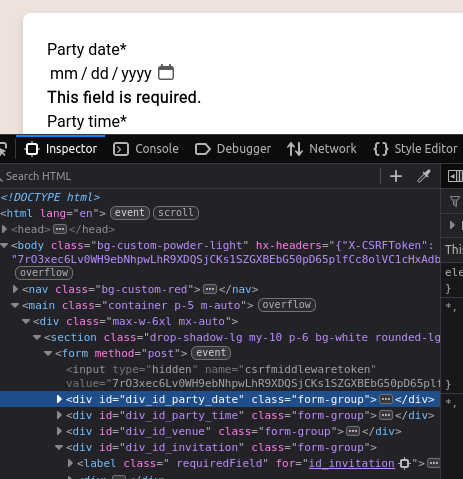

# Full-stack Django with HTMX and Tailwind

## Part 1 - Setup

### C1 - Intro

A **cheaper** alternative to full-blown React FE & Django BE 
 - HTMX & Alpine.js (JQuery?)
 - Tailwind (utility classes)

#### HTMX

##### PRO
  - 12 KB minified zipped bundle
    - 31 kb minified zipped Jquery
  - SSR
    - e.g jquery would be entirely client side
  - "easy to learn"? less JS like?
    - declarative vs imperative in JQuery
  - enable anything to trigger XHR
    - hx-get, `hx-<method>`
    - would require event listener

##### CON
 - new (community, market)
 - no replacement for react 

##### Example:

```html
<div id="parent-div">
   <button hx-post="/clicked"
       hx-trigger="click"
       hx-target="#parent-div"
       hx-swap="outerHTML"
   >
       Click Me!
   </button>
</div>

```

Usage:
 - HTMX attrs prefixed with `hx`
 - `hx-trigger`: event
 - `hx-post`: xhr, method, and route
 - `hx-target` & `hx-swap` replaces parent-div with response
    - expects HTML response (?) instead of JSON

Ref: 
 - HTMX Project https://htmx.org/


#### Tailwind

##### PRO

 - "utility" css; parameterized classes
 - mobile first
 - much narrower style scoping compared to `card`
 - generic, easy to learn: base class + parameter type & range
 - IDE integration

 ##### CON
 - tight coupling with HTML
 - verbose since additive
 - no components like in e.g. bootstrap
 - harder to learn

##### example

```html
<div class="my-4 mx-auto text-sm lg:text-2xl text-slate-700">
  Tailwind CSS is a utility-first CSS framework.
</div>
```

 - `my`
   - margin-top: 1rem; /* 16px */
   - margin-bottom: 1rem; /* 16px */
 - `mx` margin right & left, param `auto`
   - margin-left: auto;
   - margin-right: auto;
 - `text-sm`
    - font-size: 0.875rem; /* 14px */
    - line-height: 1.25rem; /* 20px */
 - `lg:text-2xl`
   - on `@media (min-width: 1024px)`
     - font-size: 1.5rem; /* 24px */
     - line-height: 2rem; /* 32px */

 - `text-slate-700`
   - color: rgb(148 163 184);
traditional:

```html

<style>
    .custom-class {
        margin: 1rem auto;
        font-size: 0.875rem;
        color: #334155; 
    }

    @media (min-width: 1024px) {
        .custom-class {
            font-size: 1.5rem;
        }
    }

</style>
<div class="custom-class">
    Tailwind CSS is a utility-first CSS framework.
</div>
```

Ref: 
 - Tailwind Project: 

#### Alpine.js - "jQuery for the modern web"

##### Pro

 - 17 kb
 - close to Vue and Angular
 - sprinkled in HTML like JQuery

##### Con
 - more like JS vs HTMX
 - data needs to be transformed to gusto of alpine
 - paid comp lib


```html
<div x-data="{ count: 0 }">
  <span x-text="count"></span>
  <button x-on:click="count++">Increment</button>
</div>
```

 - `x-data` initial 
 - `x-text` bind the data to the value of `count` 
 - `x-on:click` event listener type click with increment directive `count++`

Ref:
 - https://alpinejs.dev/

#### Outline

 -  Part 1 - setup
   - setup django, how to integrate htmx, tailwind, alpine

 - Part 2 - usage
   - HTMX
     - click to edit
     - inline validation
     - Table
       - add
       - edit
       - remove
     - bulk update
     - search & filter 
     - infinite scroll
   - Tailwind usage
   - extend htmx with Alpine
     - Tooltip
     - select all
     - show data

  - Part 3 - prep for deployment
   - Allauth
   - Cypress
   - WhiteNoise
   - Gunicorn
   - Postgres
   - Docker & Compose
   - Heroku

#### Extra

check `examples/c1`

### C3 - Django Setup

 - Start the project after creating a virtualenv

```shell
pip install uv
make compile_local
make install_local
django-admin startproject core .
django-admin startapp party
```

 - create a custom user and connect it to the admin

 - create new models
 - download fixtures
 - install fixtures
 - add pytest

### C4 - HTMX Setup

 - add to static files instead of cdn

```shell
static/party/js
$ tree  -A ./party
├── static
│   └── party
│       └── js
│           └── htmx.min.js
```

```html

<!-- ... -->
<script type="text/javascript" src=""></script> 
```

 - https://htmx.org/docs/#installing

### C5 - Tailwind

```shell

touch .nvmrc
echo v22.11.0 > .nvmrc

nvm install
nvm use

node -v
v22.11.0

npm -v
10.9.0

npm install -D tailwindcss
npx tailwindcss init
```

customizing tailwind via `[tailwind.config.js](tailwind.config.js)`
 - adding a font
 - adding colors


reusing styles:
 - group reused statements https://tailwindcss.com/docs/reusing-styles#extracting-classes-with-apply

mobile first
 - breakpoints : https://tailwindcss.com/docs/responsive-design

| Breakpoint prefix | Minimum width | CSS                                |
|-------------------|---------------|------------------------------------|
| sm                | 640px         | @media (min-width: 640px) { ... }  |
| md                | 768px         | @media (min-width: 768px) { ... }  |
| lg                | 1024px        | @media (min-width: 1024px) { ... } |
| xl                | 1280px        | @media (min-width: 1280px) { ... } |
| 2xl               | 1536px        | @media (min-width: 1536px) { ... } |

watching files

```shell
npm tailwind:dev
```

building for prod files

```shell
npm tailwind:build
```

reload page on html template changes `django_browser_reload`

### C6 - Alpine

added similar to htmx in minified form

## Part 2 - Building

### C7 - Intro

 - cases inspired by https://htmx.org/examples/ but with focus on Django
 - alpine at end of P2 
 - a lot of `partial` view will be added to deliver
   the html responses for HTMX
 - split views to 
   - main django view
   - and partials
 - split urls to group by view?
 - tests will reflect views package
 - CBV usage recap: https://testdriven.io/blog/django-class-based-vs-function-based-views/
 - TDD

### C8 - Party List

running the project currently:

```shell
# with activated virtual env
python manage.py runserver

# with right node version
npm run tailwind:dev
```

 - [conftest.py](party/tests/conftest.py) to include fixtures as factories
   https://docs.pytest.org/en/7.4.x/how-to/fixtures.html#factories-as-fixtures
 - test to check for right queryset 
 - add listing view and template
   - `empty` template tag in case iterable has no items
     https://docs.djangoproject.com/en/5.1/ref/templates/builtins/#for-empty
 - :warning: fails without login, bc non-admin login page doesn't exist

#### Design
 :warning: AI-Generated

##### 1. Layout & Structure
- **Grid-based:** Uses `grid` and `grid-cols-2` for symmetry.
- **Centered content:** `container mx-auto` ensures proper alignment.

##### 2. Spacing
- Consistent use of `p-*`, `m-*`, and `gap-*` classes for balanced layouts.

##### 3. Borders & Shadows
- Custom borders (`border-custom-red`, `border-custom-blue`) and `shadow-lg` for emphasis and depth.

##### 4. Color Scheme
- Custom colors (`custom-red`, `custom-blue`) for branding.
- Neutral backgrounds (`bg-white`, `bg-sky-200`) for contrast.

##### 5. Typography
- Clear hierarchy with `font-bold`, `text-2xl`, and `uppercase`.

##### 6. Interactivity
- Hover effects (`hover:text-custom-blue-light`) for links.

##### 7. Accessibility
- Semantic roles (`role="alert"`) and clear structure for screen readers.

##### Custom Classes
- `<tw-directive>-<custom-color>`
- `border-custom-red`

### C9 - Party Detail
 
 - `PartyDetailPage`
   - container template `page_party_detail.html`
   - which includes `partial_party_detail.html` rendering the actual party
   - which includes a `edit` button to load the form
 - `PartyDetailPartial`
   - targe of edit button `[1]` - `GET` returns the form  
   - clicked edit button returns template with save button `[2]`
   - successful save  via `PUT` returns the party `[2]`
   - CSRF token is added to the header 

`[1]`
```html
<div id="party-detail">
    <!-- rendered party details --> 
    <button class="btn-default mr-0 ml-auto block"
            hx-get=""
            hx-target="#party-detail"
    >
        Edit
    </button>
</div>
```

`[2]`
```html
<div id="party-form">
    <!-- Response will be rendered into the -->
    <form hx-put="" 
          hx-target="#party-form"
          hx-swap="outerHTML"
    >
    <!-- form fields -->
        <div class="w-full text-center">
            <button type="submit" class="btn-default">Save</button>
        </div>
    </form>
</div>
```

### C10 - Inline Validation - and create party view

Target is to create a form to 
 - create a new `Party`
 - and add inline validation for 
   - `invitation`
   - `party_date`

The HTML attributes to activate HTMX are set in  the form.
via the `attrs` argument in the field definition of the `widgets` attribute.

#### new "create" route

 - functional view `page_new_party` for simplicity
 - return create form on `GET`
 - redirect to detail view `page_single_party` on success
 - else render errors
 - no HTMX since redirect is used
 - `` needs to be in the template
   since ti was only declared for HTMX as header


#### the setup for inline validation

The key benefit is to give feedback before submitting the form.
Sth we love react for?

```python
widgets = {
    "party_date": forms.DateInput(
        attrs={
            "type": "date",
            "hx-get": reverse_lazy("partial_check_party_date"),
            "hx-trigger": "blur",
            "hx-swap": "outerHTML",
            "hx-target": "#div_id_party_date",
        }
    ),
}
```

 - `type`: controlling the default widget of browser
 - `hx-get`: the URL of the `partial_check_party_date` **running** the validation
 - `hx-trigger`: blur - meaning on focus out (i.e. after editing)
 - `hx-swap`: `outerHTML` - Replace the entire target element with the response
 - `hx-target`: `#div_id_party_date` matches ID which django generically will create
    for the `party_date` field



#### the route to validation
 
upon focus in and imitate focus out, HTMX triggers a get to the URL of `partial_check_party_date` 
in the shape of:

```javascript
await fetch("http://localhost:8000/party/new/check-date/?party_date=", {
    "credentials": "include",
    "headers": {
        "User-Agent": "Mozilla/5.0 (X11; Linux x86_64; rv:134.0) Gecko/20100101 Firefox/134.0",
        "Accept": "*/*",
        "Accept-Language": "en-US,en;q=0.5",
        "HX-Request": "true",
        "HX-Trigger": "id_party_date",
        "HX-Trigger-Name": "party_date",
        "HX-Target": "div_id_party_date",
        "HX-Current-URL": "http://localhost:8000/party/new/",
        "X-CSRFToken": "hpYZwbV1dC70l36954D4BVvGV1tys6zWbQ9CWyn68c7th0XnD2QKY2ZsApPnG42F",
        "Sec-Fetch-Dest": "empty",
        "Sec-Fetch-Mode": "cors",
        "Sec-Fetch-Site": "same-origin"
    },
    "referrer": "http://localhost:8000/party/new/",
    "method": "GET",
    "mode": "cors"
});
```

The view passes the query parameter to the form.
`party_date` is known to the form `PartyForm`.

```python
@login_required
def partial_check_party_date(request):
    form = PartyForm(request.GET)
    return HttpResponse(as_crispy_field(form["party_date"]))
```

The interesting part is that the form is not validated in its 
entirety but only in the single field `party_date`.

`as_crispy_field` renders single fields.
Below is the result. Note:
 - added class `is-invalid` in the input itself
 - all initial HTMX attributes are present
 - the error message with class `invalid-feedback`
 - form ist still valid and can be resubmitted

```html
<div id="div_id_party_date" class="form-group">
    <label for="id_party_date" class="requiredField"> 
        Party date
        <span class="asteriskField">
            *
        </span>
    </label>
    <div>
        <input
            type="date"
            name="party_date"
            value=""
            hx-get="/party/new/check-date/"
            hx-trigger="blur"
            hx-swap="outerHTML"
            hx-target="#div_id_party_date"
            class="dateinput form-control is-invalid"
            required
            aria-invalid="true"
            id="id_party_date"
        />
        <p id="error_1_id_party_date" class="invalid-feedback">
            <strong>
                This field is required.
            </strong>
        </p>
    </div>
</div>
```

#### summary

 - cool but not as easy and straightforward as doing it in javascript
 - keeps one source of authority regarding validation 
 - 
